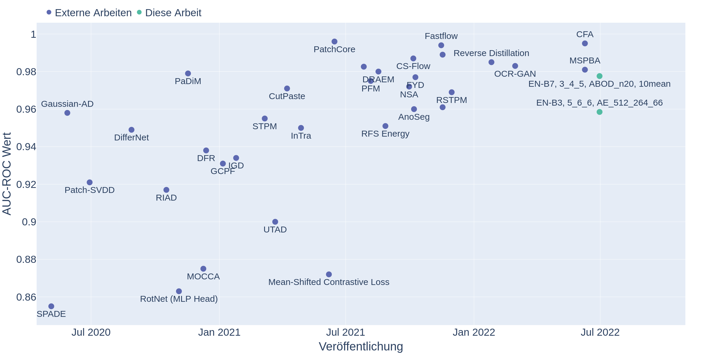

# Efficientnet Layer Propagation

This repository holds code and results for the Masterthesis of Jannis Groenberg.
For questions feel free to reach out for me.

The algorithm basically Extends the work of:

This is done by changing the Backbone from Wide-ResNets to EfficientNets and applying other outlier detection algorithms instead of k-nearest Neighbors.

The top results from the work are put into the global landscape of all Anomalie Detection Algorithms classifying the MVTecAD - Dataset
